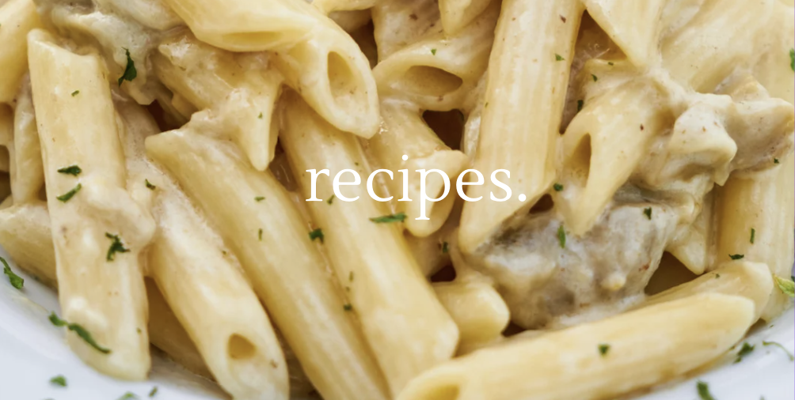
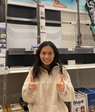
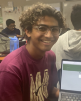

<!-- home image -->

    
    

        <pre class="mushroom-animation" style="margin: 0;">
            ___..._
        _,--'       "`-.
      ,'.  .            \
    ,/:. .     .       .'
    |;..  .      _..--'
    `--:...-,-'""\
            |:.  `.
            l;.   l
            `|:.   |
             |:.   `.,
            .l;.    j, ,
         `. \`;:.   //,/
          .\\)`;,|\'/(
           ` `itz `(,
        </pre>
        
        <pre class="mushroom-animation" style="margin: 0; margin-left: -10px;">
                 .-'~~~-.
                     .'o  oOOOo`.
                    :~~~-.oOo   o`.
                     `. \ ~-.  oOOo.
                       `.; / ~.  OO:
                       .'  ;-- `.o.'
                      ,'  ; ~~--'~
                      ;  ;
_______\|/__________\\;_\\//___\|/________
    </pre>
    
    <pre class="mushroom-animation" style="margin: 0; margin-left: -10px;">
          __....__ 
       .'"         "`. 
     .'               `.  
    .                   . 
   .       __...__       .
. _.--"""       """--._ .
:"                     ";
 `-.__    :   :    __.-'
      """-:   :-"""   
         J     L    
         :     :  
        J       L
        :       : 
        `._____.'
        </pre>

<!-- home image -->

<body style="background-color: #F5F5EF">
<!-- buttons to links -->

    

        
    

    

         
        <a href="https://gwang1224.github.io/ate-recipes/recipes.html" class="button" style="text-align: center">Search for recipes</a>
         
         
        <a href="https://gwang1224.github.io/ate-recipes/recommendations.html" class="button" style="text-align: center">Get your personalized recommendation</a>
         
         
        <a href="https://gwang1224.github.io/ate-recipes/ratings.html" class="button" style="text-align: center">Rate your recipes here</a>
         
         
        <a href="https://gwang1224.github.io/ate-recipes/blog.html" class="button" style="text-align: center">Join our community!</a>
         
    

    

 
 
 
 

    <section class="team1">
        <h1>about us</h1>
         
        <h2>welcome to ate...</h2>
        
the ultimate destination for discovering your ideal meals that not only tantalize your taste buds but also enhance your overall health and well-being. We understand that choosing the right food can be a challenge, especially when trying to balance flavor and nutrition. That's why we've created a unique website dedicated to helping you find precisely what you want to eat while prioritizing your health. At ate, we believe that healthy eating should never feel like a sacrifice. Our mission is to empower you to make informed decisions about your meals by providing personalized recommendations based on your individual preferences and specific health goals. Whether you're looking for a new recipe, aiming to follow a specific diet plan, or simply maintain a balanced lifestyle, we've got you covered.

    </section>

<!--About Our Team-->
<section class="team">
    <h1>meet the team</h1>
    

    

        

            <h1></h1>
            <h3>Claire Zhao</h3>
        

        

            <h1></h1>
            <h3>Grace Wang</h3>
        

        

            <h1></h1>
            <h3>Claire Chen</h3>
        

    

</section>
<section class="team1">
    

        

            <h1></h1>
            <h3>Ethan Tran</h3>
        

        

            <h1></h1>
            <h3>Alex Kumar</h3>
        

        

            <h1></h1>
            <h3>Advay Shindikar</h3>
        

    

</section>

<!-- Shopping List Button -->
<button class="open-button" onclick="openForm()">My Shopping List</button>

  <form action="/action_page.php" class="form-container">
    <h2>Shopping List</h2>
    <!-- shopping list -->
    <button type="button" class="btn cancel" onclick="closeForm()">Close</button>
  </form>

</body>
</html>
